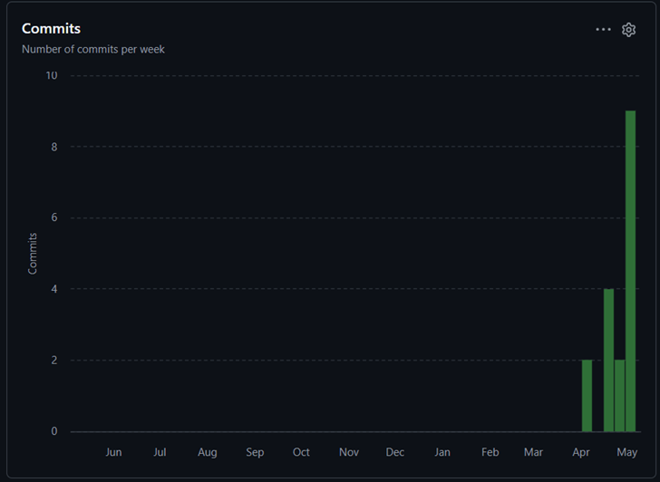

# 구르박스 (Gureubox) — 2차 발표 자료

> **변경 이력**: ~~Queue-Runner~~ → **구르박스 (Gureubox)**

---

## 1. 게임 소개

분리수거장에서 굴러 나온 **박스**가 자신을 잡으러 오는 사람들을 피해 도망치는 **2D 무한 러너** 게임입니다.

- **핵심 입력 시스템**: O / X 두 개의 버튼으로 이루어지는 **2슬롯 밀어내기 커맨드 큐**. 새 입력이 들어오면 가장 오래된 입력이 밀려나고, 두 칸이 차는 순간 즉시 행동(점프 거리)이 결정됩니다.
- **시점 구성**: **Side-View 횡스크롤 도주 → Top-View 골목 미로** 두 단계가 무한 반복되는 구조 (현재 발표 시점에서는 Side-View만 구현).
- **추격 메커닉**: 박스가 장애물에 걸려 느려지면 **관리사무소 아저씨**와의 거리가 줄어들고, 거리가 0이 되면 게임 오버.

플레이어는 박스를 직접 조작하지 않고, **2슬롯 큐로 행동을 지시**합니다. 입력 자체가 게임의 핵심 긴장감 — "다음 칸이 채워지는 순간 박스가 어떻게 움직일지"가 결정됩니다.

---

## 2. 진행 상황 (기능 시스템 단위)

| 시스템 | 진행도 | 핵심 구현 / 미구현 |
|---|---:|---|
| **커맨드 시스템** (O/X 2슬롯 밀어내기 큐) | **100%** | `CommandController`, `pushCommand()`, `fireCommand()`, 버튼 UI, 큐 상태 표시 모두 완료. `Player.canAcceptCommand()` 와 연동된 점프 중 입력 처리도 완료. |
| **캐릭터 (Player, Side-View)** | **75%** | 가상 X 좌표(`virtualX`) 기반 좌→우 이동, 4종 콤보별 점프 거리/높이/체공시간 분기, 착지 Snap 보정, 박스 비트맵 적용 완료. **남은 작업**: 점프/대기 애니메이션, Top-View 모드 캐릭터, 스프라이트 시트 적용. |
| **경비아저씨 (Janitor)** | **80%** | 가상 X 좌표 기반 일정 속도 추격, `distance` 계산, `isCaught` latch, GameOverScene 트리거 완료. **남은 작업**: 추격 모션 애니메이션, 환경미화원(미화원) 클래스, 추격 사운드. |
| **장애물 시스템** | **15%** | `MapObject` 추상 클래스 + `MapObjectRegistry` 골격만 작성됨. `MapObjectCatalog.registerAll()` 은 비어 있음. **남은 작업**: 1칸 3종, 2칸 3종, 멈춤형(자동차) 등록, `CollisionChecker`, 충돌 효과 분기, ObjectPool(`IRecyclable`+`World.obtain()`) 적용. |
| **시점 전환 (Side ↔ Top-View)** | **0%** | 시점 전환 트리거, Top-View 미로 맵, Top-View 이동 로직, 미화원 추격 AI 모두 미착수. (당초 5주차에서 6주차/7주차로 이월) |
| **HUD / 점수** | **35%** | `CommandController` 의 큐 상태 표시 + `GameOverScene` 의 GAME OVER / Restart / Exit 버튼 완료. **남은 작업**: 이동 거리 기반 점수 계산, `ImageNumber` HUD 적용, 추격자 거리 게이지(`Gauge`) 표시. |
| **리소스 / 연출** | **25%** | `gurubox_box`, `gurubox_janitor`, `gurubox_bg`, `gurubox_bg_middle` 적용. 시차(parallax) 스크롤 동작. **남은 작업**: 박스 굴러 나오는 오프닝, 1칸/2칸 장애물 스프라이트, 행인 4종 스프라이트, BGM/효과음. |

> **전체 평균 (단순 산술)**: 약 **47%**
> Side-View 핵심 메커닉(입력→이동→추격→게임오버)은 거의 완성, 장애물·시점전환·점수·리소스가 남은 작업의 대부분.

---

## 3. Git Commit 활동

### 3.1. GitHub Insights 화면

<fiqure>
    
    <figcaption>GitHub Insights - Commits (2024.04.06 ~ 2024.05.10)</figcaption>
    </figure>

### 3.2. 주차별 Commit 수 (수업 일정 기준)

| 주차 | 기간 | Commit 수 |
|---|---|---:|
| 1주차 | 4/6 ~ 4/12 | _2_ |
| 2주차 | 4/13 ~ 4/19 | _0_ |
| 3주차 | 4/20 ~ 4/26 | _4_ |
| 4주차 | 4/27 ~ 5/3 | _2_ |
| 5주차 | 5/4 ~ 5/10 | _9_ | 

---

## 4. 목표 변경 내용과 이유

1차 발표 이후 게임 컨셉을 다음과 같이 변경했습니다.

| 항목 | 기존 (1차 발표) | 변경 (현재) | 변경 이유 |
|---|---|---|---|
| **제목** | Queue-Runner | **구르박스 (Gureubox)** | "분리수거장에서 굴러나온 박스"라는 컨셉추가|
| **타임아웃 메커닉** | 제자리에 머물면 바닥이 무너짐 | **관리사무소 아저씨가 점진적으로 접근**, 거리 0 = 게임오버 | 시간 제한을 컨셉에 맞게 추격자 캐릭터로 대체하면 거리 자체가 곧 긴장감의 게이지가 되어, 별도 UI 없이도 "내가 얼마나 위험한가"가 직관적으로 보임. |
| **장애물 충돌** | 즉시 게임오버 | **종류별 효과 분기** (1칸 / 2칸 강제 / 자동차 멈춤) | 즉시 게임오버는 학습 곡선이 가파르고 "큐 입력으로 대처한다"는 핵심 재미를 살리기 어려움. 장애물 종류가 입력을 강제하게 만들어 **퍼즐+반응 속도**의 결합을 만들고자 함. |
| **시점 전환** | 아이템 획득 → Top-View 진입, 타이머 만료 시 복귀 | **Side-View 끝 도달 → Top-View 미로 진입 → 미로 탈출 시 Side-View 복귀**, 무한 반복 | 아이템 기반 전환은 "왜 갑자기 시점이 바뀌는가"의 동기 부여가 약함. 진행 기반 전환으로 바꾸면 골목 → 미로 → 골목의 **공간적 서사**가 생기고, 무한 러너의 단조로움도 줄어듦. |
| **장애물 종류** | 최소 2종 | **1칸 3종 + 2칸 3종 + 멈춤형 1종 (총 7종)** | 변경된 장애물 메커닉(종류별 효과 분기)에 맞추어 다양성이 필요. |
| **추격자 / 행인** | 없음 | **관리사무소 아저씨 / 환경미화원 / 행인 4종** 추가 | 추격 메커닉을 시각화하기 위한 필수 캐릭터. 행인은 도시 골목의 분위기 연출. |

> 핵심 원칙: **모든 변경은 "박스가 도시 골목을 굴러 도망친다"는 단일 컨셉을 강화**하는 방향입니다. 입력 시스템(2슬롯 큐)·점수·게임오버 등 게임플레이 골격은 그대로 유지했습니다.

---

## 5. Activity 구성

```
MainActivity (타이틀 화면)
    │
    │  BuildConfig.DEBUG → 1초 후 자동 startActivity + finish()
    │
    ▼
QueueRunnerActivity : BaseGameActivity
    │
    │  • 디버그 빌드일 때 격자/디버그/FPS 그래프 ON
    │  • createRootScene() 에서
    │      - gctx.metrics.setSize(1600f, 900f)   (가로 게임이므로 종횡비 변경)
    │      - return MainScene(gctx)
    │
    ▼
GameView (BaseGameActivity 가 소유)
    └─ SceneStack (MainScene 시작 → 필요 시 GameOverScene push)
```

- **`MainActivity`**: 단순 타이틀 진입점. `BuildConfig.DEBUG` 일 때 1초 후 게임으로 자동 진입 (개발 편의).
- **`QueueRunnerActivity`**: 실제 게임이 도는 Activity. `BaseGameActivity` 를 상속해 lifecycle / 풀스크린 / 뒤로가기 처리를 a2dg 프레임워크에 위임.
- **방향 고정**: AndroidManifest 에서 가로(landscape) 고정 + `metrics.setSize(1600f, 900f)` 로 가상 좌표계도 가로 비율로 변경. (a2dg 기본값 900×1600 → **1600×900 으로 swap**)

---

## 6. Scene 구성 및 전환 관계

```
            ┌────────────────────────┐
            │     MainScene          │
            │  (Side-View 게임 진행)  │
            └─────────┬──────────────┘
                      │
        janitor.isCaught == true (1회만)
                      │
                      ▼  push
            ┌────────────────────────┐
            │   GameOverScene        │
            │ (overlay, transparent) │
            └────┬───────────────┬───┘
                 │               │
        Restart  │               │ Exit / 뒤로가기
                 ▼               ▼
   popAll(false) +        popAll(true)
   push(MainScene 새로)   → onEmptyStack()
                          → Activity.finish()
```

### 6.1. MainScene
- a2dg 의 `Scene` 을 상속. `clipsRect = true` 로 가상 좌표계 밖이 클리핑됨.
- `World<Layer>` 한 개를 소유하고 layer 순서대로 update / draw.
  - **layer 정의**: `BG → FLOOR → ITEM → OBSTACLE → PLAYER → UI`
- `update()` 마지막에 `janitor.isCaught` 를 1회만 검사 → `GameOverScene(gctx).push()`.
- 배경 시차 스크롤: `player.virtualX` 의 프레임 간 delta 를 받아서 `bg.x -= delta * parallax`.

### 6.2. GameOverScene
- `isTransparent = true` → 아래의 MainScene 의 마지막 프레임이 어슴푸레 비치는 **overlay scene**.
- SceneStack 은 top scene 만 update / touch 처리하므로, **별도 freeze 플래그 없이도** MainScene 의 박스·추격자·배경이 자동으로 정지.
- 어두운 막 + GAME OVER 타이틀 + Restart / Exit 두 버튼.
  - **Restart**: `popAll(false)` 로 `onEmptyStack` callback 을 우회 → 새 `MainScene` 을 push.
  - **Exit**: `popAll(true)` → `onEmptyStack` → `Activity.finish()`.
  - **뒤로가기**: Exit 와 동일하게 처리 (게임오버 상황에서는 종료가 자연스러움).

---

## 7. MainScene 의 게임 오브젝트들

### 7.1. `Player` (PLAYER layer)

#### 그림 구성
- 비트맵: `R.mipmap.gurubox_box` (박스 이미지).
- 화면상 X 위치는 **항상 `screenX = 400f` 로 고정**, 대신 `virtualX` 가 누적 → 배경이 뒤로 밀리는 방식.
- Y 좌표는 점프 중에만 변화 (`screenY = groundY (800f)` ↔ 점프 포물선).
- 충돌 박스는 160×160 (코드 상 `RectF(screenX-80, screenY-160, screenX+80, screenY)`).

#### 동작 구성
- **상태**: `isJumping` 한 가지 (대기 ↔ 점프 중).
- **콤보별 점프 파라미터** (거리 / 높이 / 체공시간):
  - `OO` → 2칸 (400px) / 250 / 0.5s
  - `OX`, `XO` → 1칸 (200px) / 150 / 0.4s
  - `XX` → 3칸 (600px) / 350 / 0.6s
- **물리**: `startJump()` 에서 입력값(거리·높이·시간)으로부터 `speedX`, `velocityY`, `gravity` 를 **역산**.
  - `speedX = distance / duration`
  - `velocityY = -(4 * jumpHeight) / duration`
  - `gravity = (8 * jumpHeight) / duration²`
- **착지 Snap**: 프레임 오차 누적을 막기 위해 `screenY >= groundY` 일 때 `virtualX = targetVirtualX` 로 강제 보정.

#### 핵심 코드 (책임)
```kotlin
// startJump() : 콤보 → 물리 파라미터 역산 (Player 의 핵심 책임)
when (combo) {
    "OO"       -> { distance = blockSize*2; jumpHeight = 250f; jumpDuration = 0.5f }
    "OX","XO"  -> { distance = blockSize*1; jumpHeight = 150f; jumpDuration = 0.4f }
    "XX"       -> { distance = blockSize*3; jumpHeight = 350f; jumpDuration = 0.6f }
}
targetVirtualX = virtualX + distance
speedX    = distance / jumpDuration
velocityY = -(4f * jumpHeight) / jumpDuration
gravity   = (8f * jumpHeight) / (jumpDuration * jumpDuration)
```
이 함수가 곧 "콤보가 어떤 점프를 만드는가"라는 게임의 입력→출력 매핑 전체.

#### 상호작용
- **CommandController** → `enqueueCombo("OO" 등)` 로 점프 명령 받음.
- **CommandController** ← `canAcceptCommand()` 로 "지금 입력 받을 수 있는지" 응답 (점프 중 + 큐 비어있지 않음 → false).
- **Janitor** ← `player.virtualX` 를 읽어 거리(`distance`) 계산.
- **MainScene** ← `player.virtualX` 의 프레임 delta 로 배경 시차 스크롤.

#### UX 진행
1. 플레이어가 O/X 버튼을 두 번 탭 → CommandController 가 콤보 완성.
2. Player 의 `commandQueue` 에 enqueue.
3. 대기 상태이면 다음 프레임에 `startJump()` → 점프 시작.
4. 점프 중에는 추가 입력이 큐에 쌓이거나, `canAcceptCommand()` 가 false 를 돌려 입력이 차단.
5. 착지 → 큐에 다음 콤보 있으면 즉시 다음 점프, 없으면 대기.

---

### 7.2. `Janitor` (관리사무소 아저씨, PLAYER layer)

#### 그림 구성
- 비트맵: `R.mipmap.gurubox_janitor`.
- 크기: 300×360 (`HALF_WIDTH=150`, `HEIGHT=360`).
- **화면상 X = `playerScreenX(400) - distance`**: 박스에서 가상 거리만큼 왼쪽으로 떨어진 점에 그림.
  - 박스가 멀리 도망갈수록 아저씨가 화면 왼쪽으로 멀어짐.
  - 박스가 멈춰 있으면 점점 박스에 가까워짐 (시각적 긴장감).

#### 동작 구성
- 박스 입력과 **무관하게** 매 프레임 일정한 `SPEED = 400f/s` 로 `virtualX += SPEED * frameTime`.
- 시작 시점 `virtualX = -700f` (= 박스보다 700px 뒤).
- `distance = player.virtualX - virtualX` 가 `0` 이하로 떨어지면 `isCaught = true` (한번 true 면 다시 false 안 됨).

#### 핵심 코드 (책임)
```kotlin
override fun update(gctx: GameContext) {
    if (isCaught) return                       // ① 잡힌 후엔 정지
    virtualX += SPEED * gctx.frameTime         // ② 일정 속도 전진
    if (distance <= 0f) isCaught = true        // ③ 한 번만 latch
}
```
"추격자는 일정 속도, 박스는 점프로만 전진" 이라는 게임 룰을 이 6줄이 전부 표현.

#### 상호작용
- **Player** → `player.virtualX` 를 읽음 (생성자 주입).
- **MainScene** ← `janitor.isCaught` 가 true 가 되는 첫 프레임에 GameOverScene push.
- **GameOverScene 등장 후**: SceneStack 이 top 만 update 하므로 Janitor 의 update 자체가 중단됨 → 화면에는 박스에 거의 닿은 모습으로 정지.

#### UX 진행
1. 게임 시작 시 화면 왼쪽 바깥 (혹은 가장자리) 에서 박스를 추격.
2. 박스가 점프로 자주 전진 → distance 유지/증가 → 아저씨가 화면 밖에 머무름.
3. 박스가 입력이 없거나 장애물에 멈춤 → distance 감소 → 아저씨가 점점 화면 안으로 들어옴.
4. distance ≤ 0 → `isCaught` → GameOverScene 등장.

---

### 7.3. `CommandController` (UI layer)

#### 동작 구성
- 길이 2 의 `MutableList<Command>` 를 **밀어내기 큐**로 운용:
  - `queue.size >= 2` 면 `removeAt(0)` 로 가장 오래된 항목 제거 후 `add(cmd)`.
  - `queue.size == 2` 가 되는 순간 `fireCommand(cmd1, cmd2)` 호출.
- 터치 처리: `ACTION_DOWN` 만 받음. O/X 버튼 영역에 들어왔을 때만 `pushCommand()` 호출.
- 입력 게이트: `if (!player.canAcceptCommand()) return` → 점프 중엔 입력 무시.

#### 핵심 코드 (책임)
```kotlin
private fun pushCommand(cmd: Command) {
    if (!player.canAcceptCommand()) return            // ① 입력 게이트
    if (queue.size >= 2) queue.removeAt(0)            // ② 밀어내기
    queue.add(cmd)
    if (queue.size == 2) fireCommand(queue[0], queue[1])  // ③ 발동
}
```

#### 상호작용
- **Player** → `enqueueCombo("OO")` 로 콤보 전달, `canAcceptCommand()` 로 입력 가능 여부 질의.
- **MainScene.onTouchEvent**: 가장 먼저 controller 에게 touch 를 줘 본 뒤, 처리되지 않으면 World 의 다른 ITouchable 로 dispatch.

#### UX 진행
- 화면 하단 두 버튼이 항상 보임.
- 사용자가 한 번 탭 → 큐에 1칸 채워짐 → 화면 상단에 CMD: [ O ] [ _ ] 같이 표시.
- 한 번 더 탭 → 큐 2칸 → 즉시 콤보 발동, Player 가 점프.
- 발동 후에도 큐는 유지 → 다음 탭은 가장 오래된 입력을 밀어내며 새 콤보 즉시 완성 (= 연속 콤보).
---