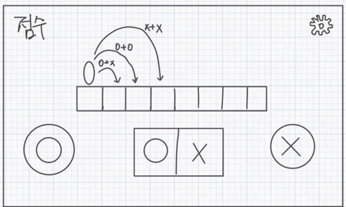
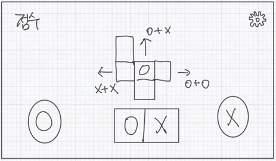

# Queue-Runner

## 게임 컨셉
### High Concept
- 두 개의 버튼을 조합하여 행동을 예약하고, 갱신되는 커맨드에 따라 캐릭터를 이동시켜 장애물을 돌파하는 2D 무한 러너 게임입니다
### 핵심 메카닉
- 화면의 두 개 버튼(O, X)을 누르면 행동칸 두 개에 입력이 순차적으로 저장되어 캐릭터의 행동이 결정됩니다.
- 행동이 발동된 후에도 기존 커맨드가 비워지지 않습니다. 새 버튼을 누르면 가장 오래된(왼쪽) 버튼이 밀려나고 새로운 조합이 즉시 완성됩니다.
- 조작을 멈추고 제자리에 일정 시간 머무르면 바닥이 무너져 게임이 종료됩니다.
- 장애물을 커맨드 조합으로 뛰어넘어 점수를 획득하며, 장애물과 충돌 시 즉시 게임이 종료됩니다.
- 게임 진행 중 특정 아이템을 획득하면 일정 시간 동안 시점이 Side-View(횡스크롤)에서 Top-View(종스크롤)로 전환되며,  게임의 진행 방향(아래에서 위로)과 커맨드 조합에 따른 이동 방식이 완전히 변경됩니다.
	-  Side-View
		- O + O: 오른쪽으로 2칸 이동
		- O + X: 오른쪽으로 1칸 이동
		- X + O: 오른쪽으로 1칸 이동
		- X + X: 오른쪽으로 3칸 이동
	- Top-View
		- O + O: 오른쪽으로 1칸 이동
		- O + X: 위로 1칸 이동
		- X + O: 위로 1칸 이동
		- X + X: 왼쪽으로 1칸 이동

## 개발 범위
- 2슬롯 밀어내기 커맨드 처리 시스템 및 캐릭터 이동 구현
- 제자리 체크 및 바닥 무너짐 처리
- 장애물과의 충돌 처리
- 아이템 획득 시 시점 전환 및 이동 방식 변경 처리
- 점수 시스템 및 게임 오버 처리
- 간단한 UI 및 그래픽 요소 구현
	- 캐릭터: 최소 2가지 모습 (Side-View, Top-View)
	- 장애물: 최소 2가지 종류
	- 아이템: 시점 전환 아이템

## 예상 게임 실행 흐름
<figure>
  
  <figcaption style="font-size: 13px;">Side-View</figcaption>
</figure>
<figure>
  
  <figcaption style="font-size: 13px;">Top-View</figcaption>
</figure>

## 개발 일정
- **1주차 (4/6 ~ 4/12):** 프레임워크 제작
- **2주차 (4/13 ~ 4/19):** 2슬롯 커맨드 밀어내기 입력 시스템 구현 및 UI 연동
- **3주차 (4/20 ~ 4/26):** Side-View 시점에서 캐릭터 이동 구현
- **4주차 (4/27 ~ 5/3):** Top-View 시점에서 캐릭터 이동 구현
- **5주차 (5/4 ~ 5/10):** 장애물 충돌처리 및 시점 전환 아이템 구현
- **6주차 (5/11 ~ 5/17):** 제자리 체크 및 Side-View 복귀 타이머 연동, 점수 시스템 구현
- **7주차 (5/18 ~ 5/24):** 캐릭터 및 장애물 이미지 추가, 게임 오버 처리 및 UI 개선
- **8주차 (5/25 ~ 5/31):** 장애물 출현 패턴 다양화